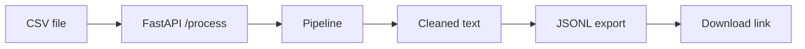

# CleanLLM SaaS

Turn messy **CSV text** into **JSONL training data** for LLM fine-tuning — with a web UI, REST API, and one-click deploy.

[](https://cleanllm-saas.onrender.com)
[](https://fastapi.tiangolo.com/)
[](https://www.python.org/)
[](LICENSE)

> **Live demo → [https://cleanllm-saas.onrender.com](https://cleanllm-saas.onrender.com)**  
> Upload a CSV, download JSONL. First load after idle may take ~30s on the free tier

---

## About

Preparing data for language models usually means cleaning raw exports, removing duplicates, and formatting rows as prompt/response pairs. CleanLLM automates that in a small pipeline you can demo in a browser or call from code.

**What it does**

1. Accepts a CSV with a `text` column  
2. Drops empty rows and duplicates  
3. Normalizes text (lowercase, strip punctuation, collapse whitespace)  
4. Builds JSONL lines: `{ "prompt": "...", "response": "..." }`  
5. Returns a download link and shows the job on a dashboard  

Built as a **portfolio / resume project** to show full-stack Python, API design, file handling, and cloud deployment — not a production SaaS (no auth or billing yet).

---

## Try it

| | Link |
|---|------|
| **Live app** | [https://cleanllm-saas.onrender.com](https://cleanllm-saas.onrender.com) |
| Upload page | [https://cleanllm-saas.onrender.com/upload](https://cleanllm-saas.onrender.com/upload) |
| API docs | [https://cleanllm-saas.onrender.com/docs](https://cleanllm-saas.onrender.com/docs) |

Download sample files (also in the [`samples/`](samples/) folder on GitHub):

| File | Download |
|------|----------|
| Input CSV | [/samples/input](https://cleanllm-saas.onrender.com/samples/input) · [`samples/sample-input.csv`](samples/sample-input.csv) |
| Output JSONL | [/samples/output](https://cleanllm-saas.onrender.com/samples/output) · [`samples/sample-output.jsonl`](samples/sample-output.jsonl) |

Or use root [`sample.csv`](sample.csv) (same as sample input).

> **After you deploy:** Replace `cleanllm-saas.onrender.com` everywhere in this README with your real Render URL (Find & Replace).

---

## Features

- **Web UI** — drag-and-drop CSV upload, progress feedback, download button  
- **Cleaning pipeline** — dedupe, empty-row removal, text normalization, tokenization  
- **JSONL export** — one JSON object per line, common fine-tuning format  
- **Job dashboard** — list of processed files in the current session  
- **REST API** — `POST /process`, `GET /download/{file_id}`, OpenAPI at `/docs`  
- **Deploy-ready** — `render.yaml`, `Dockerfile`, health check at `/health`  

---

## Tech stack

| Layer | Tools |
|-------|--------|
| Backend | [FastAPI](https://fastapi.tiangolo.com/), [Uvicorn](https://www.uvicorn.org/) |
| Data | [pandas](https://pandas.pydata.org/) |
| Frontend | Server-rendered HTML, CSS, vanilla JS |
| Deploy | [Render](https://render.com) (Blueprint) or Docker |

---

## How it works

```
CSV upload  →  pandas DataFrame  →  clean / dedupe  →  prompt–response pairs  →  .jsonl file
```



---

## Screenshots

_Add 1–2 screenshots after deploy (Upload page + success result) and commit them to `docs/images/`._

---

## Input format

Your CSV must have a header row and a column named **`text`** (case-insensitive after upload).

```csv
text
"Your first training sentence here."
"Another row of raw text."
```

See [`sample.csv`](sample.csv) for a working example.

---

## Local development

```bash
git clone https://github.com/YOUR_USERNAME/cleanllm-saas.git
cd cleanllm-saas

python3 -m venv venv
source venv/bin/activate          # Windows: venv\Scripts\activate

pip install -r requirements.txt
uvicorn app.main:app --reload --host 127.0.0.1 --port 8000
```

Open [http://127.0.0.1:8000](http://127.0.0.1:8000) and upload `sample.csv`.

---

## Publish to GitHub (first time)

### 1. What to upload vs keep local

| Upload to GitHub ✅ | Keep on your PC only ❌ |
|---------------------|-------------------------|
| `app/`, `requirements.txt`, `README.md` | `venv/` (virtual environment) |
| `render.yaml`, `Dockerfile`, `sample.csv` | `.env` (API keys, secrets) |
| `.gitignore` | `app/storage/outputs/*.jsonl` (generated files) |

- **`requirements.txt`** = list of packages (small file) → **always commit**  
- **`venv/`** = installed packages on your machine → **never commit**  
- Render runs `pip install -r requirements.txt` and builds its own environment.

### 2. Push the repo

```bash
cd cleanllm-saas

# One-time identity for this folder (use your GitHub email)
git config user.email "you@example.com"
git config user.name "YOUR_GITHUB_USERNAME"

git add .
git status    # confirm venv/ and *.jsonl are NOT listed
git commit -m "CleanLLM SaaS — portfolio project"
```

Create a **public** repo at [github.com/new](https://github.com/new) named `cleanllm-saas`, then:

```bash
git remote add origin https://github.com/YOUR_USERNAME/cleanllm-saas.git
git branch -M main
git push -u origin main
```

### 3. Set GitHub About box

Repo page → **⚙️ About** → fill in Description, Website (live demo URL), and Topics (see [GitHub repo settings](#github-repo-settings-copy-paste) below).

---

## Deploy (Render)

1. Push this repo to GitHub (see [Publish to GitHub](#publish-to-github-first-time)).  
2. [render.com](https://render.com) → sign in with GitHub → **New** → **Blueprint**.  
3. Select the `cleanllm-saas` repo — Render reads [`render.yaml`](render.yaml) automatically.  
4. Wait for build (~3–5 min).  
5. Copy your URL (e.g. `https://cleanllm-saas.onrender.com`) into this README and GitHub **Website**.

**Free tier notes**

- App **sleeps after ~15 min idle**; first visit may take 30–60s to wake up.  
- Uploads and job history are **ephemeral** (lost on redeploy) — fine for demos.

### Docker (optional — not required for Render Blueprint)

[`Dockerfile`](Dockerfile) packages the app in a container for Railway, Fly.io, or local runs. Render Blueprint uses **Python directly** (`render.yaml`), not Docker, unless you switch the service type.

```bash
docker build -t cleanllm .
docker run -p 8000:8000 cleanllm
```

---

## API reference

| Method | Path | Description |
|--------|------|-------------|
| `GET` | `/` | Home |
| `GET` | `/upload` | Upload UI |
| `POST` | `/process` | Process CSV (`multipart/form-data`, field `file`) |
| `GET` | `/download/{file_id}` | Download JSONL |
| `GET` | `/dashboard` | Job history (session) |
| `GET` | `/health` | Health check |
| `GET` | `/docs` | Swagger UI |
| `GET` | `/samples/input` | Download sample CSV |
| `GET` | `/samples/output` | Download sample JSONL |
| `GET` | `/samples` | Sample file paths (JSON) |

**Example (curl):**

```bash
curl -X POST -F "file=@sample.csv" https://cleanllm-saas.onrender.com/process
```

---

## Project structure

```
cleanllm-saas/
├── app/
│   ├── main.py              # FastAPI app + static files
│   ├── core/pipeline.py     # CSV → cleaned dataset
│   ├── routes/              # UI + upload + download + dashboard
│   ├── services/            # File paths + IDs
│   ├── static/css/          # UI styles
│   └── ui/layout.py         # Shared HTML layout
├── sample.csv               # Demo input (same as samples/sample-input.csv)
├── samples/
│   ├── sample-input.csv     # Example upload file
│   └── sample-output.jsonl  # Example pipeline output
├── requirements.txt
├── render.yaml              # Render Blueprint
├── Dockerfile
└── README.md
```

---

## GitHub repo settings (copy-paste)

Pick one **Description** for the About box:

```
FastAPI app: clean CSV text and export JSONL datasets for LLM fine-tuning. Live demo included.
```

```
CSV → clean text → JSONL training pairs. Full-stack FastAPI demo for LLM dataset prep.
```

```
Turn messy CSV text into training-ready JSONL with a simple upload pipeline.
```

**Website:**

```
https://cleanllm-saas.onrender.com
```

**Topics** (add separately in GitHub):

```
fastapi python pandas llm machine-learning dataset jsonl nlp portfolio-project webapp
```

---

## Resume bullet (example)

> **CleanLLM SaaS** — [Live demo](https://cleanllm-saas.onrender.com) · Designed and deployed a FastAPI pipeline that converts CSV text into JSONL training data; includes REST API, web UI, and Render/Docker deployment.

---

## Roadmap

- [ ] Real LLM-generated responses (instead of placeholder)
- [ ] Persistent storage + database for job history
- [ ] User authentication for multi-tenant use

---

## License

MIT — free to use for learning and portfolio projects.

---

## Author

**Your Name** · [GitHub](https://github.com/YOUR_USERNAME) · Portfolio project
