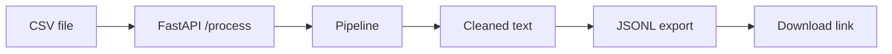

# CleanLLM SaaS

Turn messy **CSV text** into **JSONL training data** for LLM fine-tuning — with a web UI, REST API, and one-click deploy.

[](https://clean-llm-dataset-pipeline.vercel.app/)
[](https://fastapi.tiangolo.com/)
[](https://www.python.org/)
[](LICENSE)

> Upload a CSV, download JSONL. First load after idle may take ~30s on the free tier

---

## About

Preparing data for language models usually means cleaning raw exports, removing duplicates, and formatting rows as prompt/response pairs. CleanLLM automates that in a small pipeline you can demo in a browser or call from code.

**What it does**

1. Accepts a CSV with a `text` column  
2. Drops empty rows and duplicates  
3. Normalizes text (lowercase, strip punctuation, collapse whitespace)  
4. Builds JSONL lines: `{ "prompt": "...", "response": "..." }`  
5. Returns a download link and shows the job on a dashboard  

Built as a **Fun project** to show full-stack Python, API design, file handling, and cloud deployment — not a production SaaS (no auth or billing yet).

---

## Try it

| | Link |
|---|------|
| **Live app** | [https://clean-llm-dataset-pipeline.vercel.app) |
| Upload page | [https://clean-llm-dataset-pipeline.vercel.app/upload) |
| API docs | [https://clean-llm-dataset-pipeline.vercel.app/docs) |

Download sample files (also in the [`samples/`](samples/) folder on GitHub):

| File | Download |
|------|----------|
| Input CSV | [/samples/input](https://cleanllm-saas.onrender.com/samples/input) · [`samples/sample-input.csv`](samples/sample-input.csv) |
| Output JSONL | [/samples/output](https://cleanllm-saas.onrender.com/samples/output) · [`samples/sample-output.jsonl`](samples/sample-output.jsonl) |

---

## Features

- **Web UI** — drag-and-drop CSV upload, progress feedback, download button  
- **Cleaning pipeline** — dedupe, empty-row removal, text normalization, tokenization  
- **JSONL export** — one JSON object per line, common fine-tuning format  
- **Job dashboard** — list of processed files in the current session  
- **REST API** — `POST /process`, `GET /download/{file_id}`, OpenAPI at `/docs`  
- **Deploy-ready** — `render.yaml`, `Dockerfile`, health check at `/health`  

---

## Tech stack

| Layer | Tools |
|-------|--------|
| Backend | [FastAPI](https://fastapi.tiangolo.com/), [Uvicorn](https://www.uvicorn.org/) |
| Data | [pandas](https://pandas.pydata.org/) |
| Frontend | Server-rendered HTML, CSS, vanilla JS |
| Deploy | [vercel](https://vercel.com/) |

---

## How it works

```
CSV upload  →  pandas DataFrame  →  clean / dedupe  →  prompt–response pairs  →  .jsonl file
```



---

## Input format

Your CSV must have a header row and a column named **`text`** (case-insensitive after upload).

```csv
text
"Your first training sentence here."
"Another row of raw text."
```

See [`sample.csv`](sample.csv) for a working example.

---

## Local development

```bash
git clone https://github.com/Mr_nishan/clean-llm-dataset-pipeline.git
cd cleanllm-saas

python3 -m venv venv
source venv/bin/activate          # Windows: venv\Scripts\activate

pip install -r requirements.txt
uvicorn app.main:app --reload --host 127.0.0.1 --port 8000
```

Open [http://127.0.0.1:8000](http://127.0.0.1:8000) and upload `sample.csv`.
